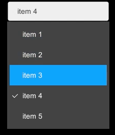

# Unity-UI-Controls
Unity UI Controls

## ListBox

### Usage
On your hierarchy view, 
right click -> UI/Controls/ListBox .

On added ListBox inspector,

1. Set your ListBox item strings as String[] items.
2. Set "Selected Index" value, that is an index of initial selectd item index.
3. Set callback event "OnSelected", that is called with the selected string argument when clicking the item
